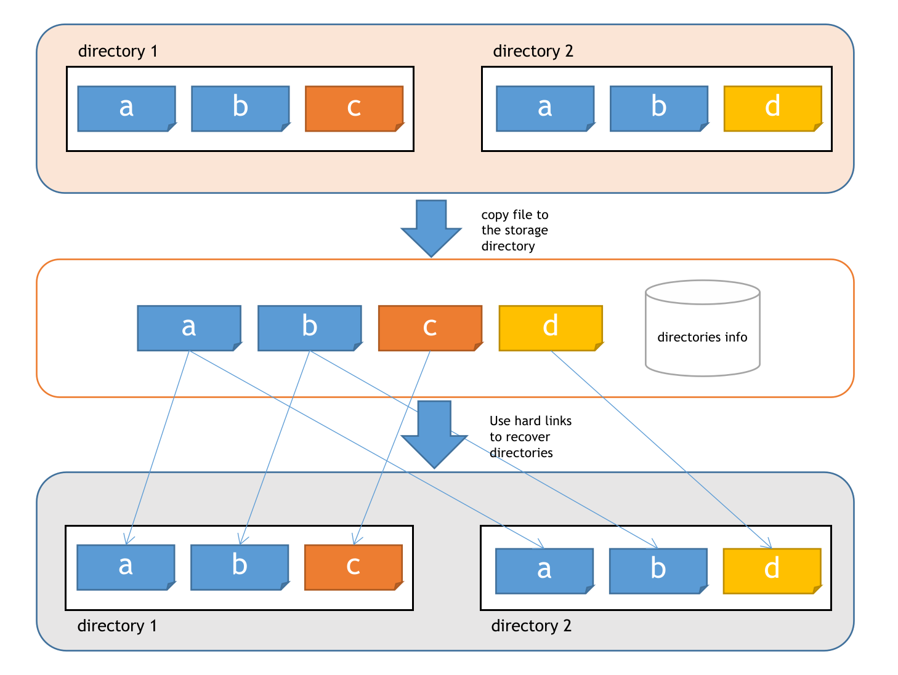

# hash box

增量同步工具

## 原理



通过计算目录中文件的md5值,可判断两个目录中有哪些文件相同,相同文件可以只存储一份。

两个目录中的文件以该文件的md5值为名称存储，并记录目录的目录结构和文件md5的映射关系。

恢复时使用硬链接将文件链接到目标地址即可

## 安装

```bash
cargo install --path ./
```

## 用法

```bash
hbx add the-path-of-file
```

添加目录或者文件到本地存储中

```bash
hbx list
```

查看本地存储中目录或文件名称

```bash
hbx get file-name
```

将存储中的文件恢复到当前执行目录

```bash
hbx delete file-name
```

根据名称删除存储中的文件或者目录

```bash
hbx push user@host file-name --install
```

将存储中的文件推送到服务器,需免密登陆。当服务器没有安装hbx命令时`--install` 参数 会在服务器上安装hbx

```bash
hbx pull user@host file-name
```

根据文件名称增量下载文件，需免密登陆

## License

Apache-2.0